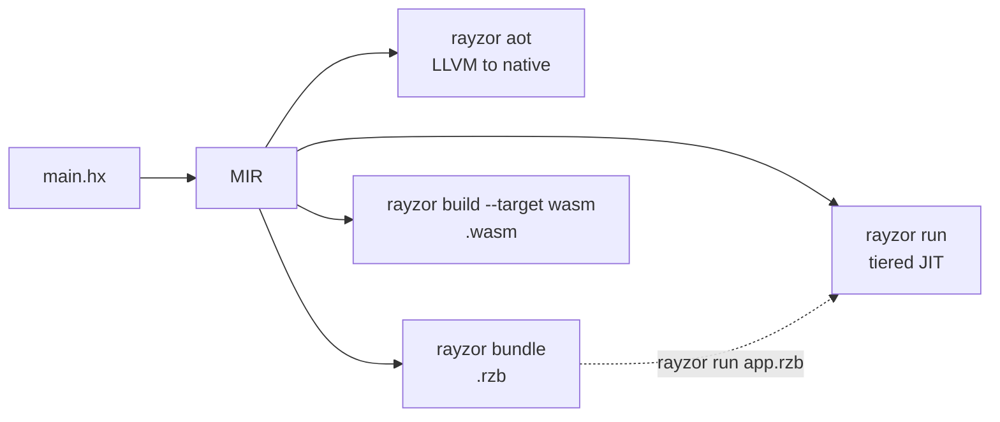

# Rayzor CLI Reference

Every command below is `rayzor <command>`. Run `rayzor <command> --help` for the
authoritative flag list — this document explains what the commands are *for*.

For how the compiler works internally, see
[Architecture](architecture/ARCHITECTURE.md).

---

## Compilation modes

Rayzor compiles the same MIR through different backends depending on what you
are doing. Picking a mode means picking a command.

| You want to | Command | What happens |
|---|---|---|
| Run code while developing | `rayzor run main.hx` | Tiered JIT: starts interpreted, promotes hot functions to Cranelift, then LLVM |
| Type-check only | `rayzor check main.hx` | Parse and type-check, no codegen |
| Ship a native binary | `rayzor aot main.hx -o app` | Whole program through LLVM, linked against the runtime |
| Ship one portable artifact | `rayzor bundle main.hx -o app.rzb` | Serialized MIR in a single file, run later with `rayzor run app.rzb` |
| Target the browser or WASI | `rayzor build --target wasm` | WebAssembly module |
| Inspect the pipeline | `rayzor compile main.hx --stage mir` | Stop at any stage and print it |



### Tiering, in one paragraph

`rayzor run` starts in the MIR interpreter so execution begins immediately, and
promotes a function to a compiled tier once it has run enough times. Presets pick
the thresholds for you; `--tier-thresholds` overrides them directly. A preset is
a policy, not a backend: `script` never promotes, `embedded` stays interpreted,
`benchmark` bails out to compiled code immediately.

| Preset | Intended for |
|---|---|
| `script` | CLI tools and one-shot scripts — instant startup, no promotion |
| `application` | Desktop apps and web servers — balanced, includes LLVM (**default**) |
| `server` | Long-running services — aggressive optimization |
| `benchmark` | Performance testing — immediate bailout, manual LLVM upgrade |
| `development` | Debugging — verbose logging |
| `embedded` | Constrained environments — interpreter only |

---

## Commands

### `rayzor run` — execute with tiered JIT

```bash
rayzor run [FILE] [OPTIONS] [-- PROGRAM_ARGS...]
```

`FILE` may be a `.hx` source file or a prebuilt `.rzb` bundle. Omit it and the
entry point comes from `rayzor.toml`. Arguments after `--` are passed to the
Haxe program, not to the compiler.

| Flag | Effect |
|---|---|
| `--preset <NAME>` | Tier policy (table above). Default `application` |
| `--tier <0-3>` | Starting tier |
| `--llvm` | Enable LLVM tier 3 |
| `--tier-thresholds <I/W/H[/B]>` | Override promotion thresholds, e.g. `1/15/5` |
| `--tier-sample-rate <N>` | Profiling sample rate |
| `--tier-start-interpreted <bool>`, `--tier-promotion <bool>` | Override the resolved tier config |
| `--preset-override-toml` | Let `--preset` win over the manifest's `[tier]` |
| `--no-cache`, `--cache-dir <DIR>` | Control the BLADE cache (**on by default**) |
| `--release` | Use `target/release` paths |
| `--rpkg <FILE>` | Load an `.rpkg` package (repeatable) |
| `--native-lib <FILE>` | Load a native plugin dylib directly, without a manifest |
| `--safety-warnings on\|off` | Use-after-move and related diagnostics. Default `on` |
| `--wasm` | Compile to WASM and run it in the embedded wasmtime sandbox |
| `-i`, `--interactive` | Open the TUI after execution (scroll, search) |
| `--stats`, `-v` | Compilation statistics, verbose output |

### `rayzor aot` — native executable via LLVM

```bash
rayzor aot [FILES...] -o app
```

| Flag | Effect |
|---|---|
| `--emit <FORMAT>` | `exe` (default), `obj`, `llvm-ir`, `llvm-bc`, `asm` |
| `-O, --opt-level <0-3>` | Optimization level. Default `2` |
| `--target <TRIPLE>`, `--sysroot <DIR>`, `--linker <PATH>` | Cross-compilation |
| `--strip` | Tree-shake unreachable code |
| `--strip-symbols` | Strip debug symbols from the binary |
| `--runtime-dir <DIR>` | Where to find `librayzor_runtime.a` |
| `--no-cache`, `--cache-dir <DIR>` | BLADE cache control |

### `rayzor bundle` — single-file `.rzb`

```bash
rayzor bundle [FILES...] -o app.rzb
```

Serializes every compiled module into one file so startup skips compilation.
Run it with `rayzor run app.rzb`.

| Flag | Effect |
|---|---|
| `-O, --opt-level <0-3>` | Optimization level. Default `2` |
| `--strip` | Tree-shake unreachable code |
| `--no-compress` | Disable zstd compression |
| `--no-cache`, `--cache-dir <DIR>` | BLADE cache control |

### `rayzor build` — build from a manifest or HXML

```bash
rayzor build [FILE]
```

Resolution order: an explicit `.hxml` file, else `rayzor.toml` in the current
directory, else the manifest's `hxml = "build.hxml"` delegation.

| Flag | Effect |
|---|---|
| `--target native\|wasm\|wasm-wasi` | Output target. Default `native` |
| `--browser` | Also emit a browser HTML harness (with `--target wasm`) |
| `--opt-level <0-3>` | MIR optimization level. Default `2` |
| `-o <PATH>`, `--strip`, `--dry-run`, `-v` | Output path, symbol stripping, plan-only, verbose |

### `rayzor check` — type-check

```bash
rayzor check main.hx [--show-types] [--format text|json|pretty]
```

### `rayzor compile` — stop at a stage

```bash
rayzor compile main.hx --stage ast|tast|hir|mir|native
```

Useful for seeing what each stage produced; `--show-ir` prints the
intermediate representation, `-o` writes it to a file.

### `rayzor dump` — read the MIR

```bash
rayzor dump main.hx [--function NAME] [--diff] [--format text|dot] [-i]
```

`--diff` shows the MIR before and after optimization, which is the fastest way
to see what a pass did. `--cfg-only` prints the control flow graph without
instructions; `--format dot` emits Graphviz; `-i` opens the interactive viewer.

### `rayzor cache` — BLADE module cache

```bash
rayzor cache stats | list | warm | clear
```

`warm` pre-compiles the standard library so the first real build does not pay
for it.

### `rayzor init` — scaffold a project

```bash
rayzor init --name my-app [--template app|lib|benchmark|empty]
rayzor init --name my-workspace --workspace --members a,b
rayzor init --from-hxml build.hxml
```

### `rayzor rpkg` — packages

```bash
rayzor rpkg pack | inspect | install | add | remove | list | strip
```

`.rpkg` packages carry Haxe sources and, optionally, native dylibs. `strip`
reduces a package to a single platform's native library.

### `rayzor debug` — investigative toolkit

```bash
rayzor debug run     # forensic run, crash handlers pre-armed
rayzor debug bench   # run N times, per-run metrics plus aggregate stats
rayzor debug compare # A/B two git refs, report the median delta
rayzor debug resolve # hex PCs from a crash dump → Haxe functions and lines
rayzor debug lldb    # launch under lldb
rayzor debug server  # live metrics over HTTP with a browser dashboard
```

`compare` restores the working tree on exit, including on failure.

### Others

```bash
rayzor jit main.hx          # JIT with an interactive REPL
rayzor preblade             # extract stdlib symbols to .bsym
rayzor lsp                  # Language Server, for editor integration
rayzor info [--features] [--tiers]
```

---

## Project manifest (`rayzor.toml`)

```toml
[project]
name = "my-app"
version = "0.1.0"
entry = "src/Main.hx"

[build]
class-paths = ["src"]
opt-level = 2
preset = "application"
output = "build/my-app"

[cache]
enabled = true
```

A workspace lists its members instead:

```toml
[workspace]
members = ["game", "engine", "tools/level-editor"]

[workspace.cache]
dir = ".rayzor/cache"
```

An existing HXML build can be delegated to rather than ported:

```toml
[project]
name = "legacy-app"
hxml = "build.hxml"
```

A project that depends on native plugins must declare **both** the class paths
and the native libraries; a consumer with only one of the two will fail to
resolve at run time.

---

## Environment variables

Mostly for debugging the compiler itself.

| Variable | Effect |
|---|---|
| `RAYZOR_STD_PATH` | Override the standard library location |
| `RAYZOR_RAW_MIR=1` | Skip all optimization passes in `rayzor dump` |
| `RAYZOR_PASS_DEBUG=1` | Run MIR passes one at a time, reporting what each changed |
| `RAYZOR_DISABLE_PASSES=<names>` | Disable named MIR passes (bundle path) — bisect a miscompile |
| `RAYZOR_NO_SRA=1`, `RAYZOR_NO_PHI_SRA=1` | Disable scalar replacement, or only its phi-aware part |
| `RAYZOR_NO_FMA=1` | Disable FMA fusion in instruction lowering |
| `RAYZOR_LLVM_OPT=<0-3>` | Override the LLVM optimization level |
| `RAYZOR_DUMP_CLIF=1` | Print Cranelift IR |
| `RAYZOR_DUMP_LLVM_IR=1` | Print LLVM IR around optimization |
| `RAYZOR_DUMP_FN_PTRS=1` | Print the resolved function pointer table |
| `RAYZOR_STRICT_MOVE_CHECK=1` | Make the interpreter strict about move violations |
