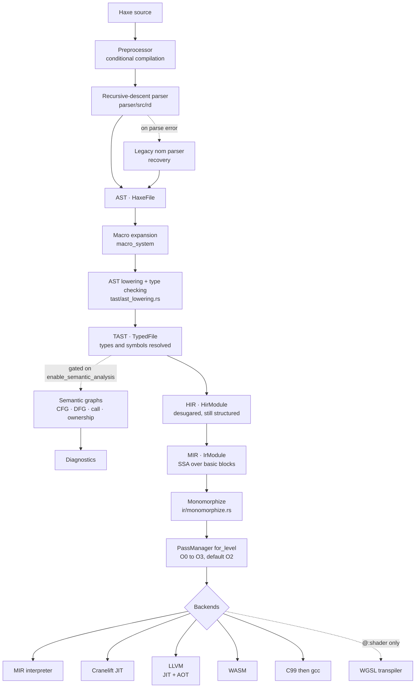
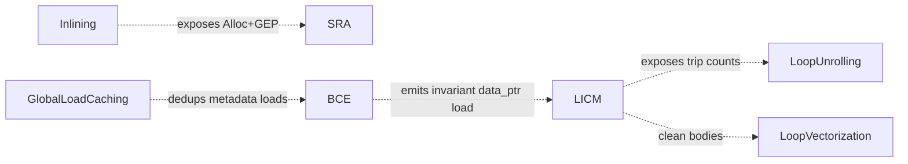
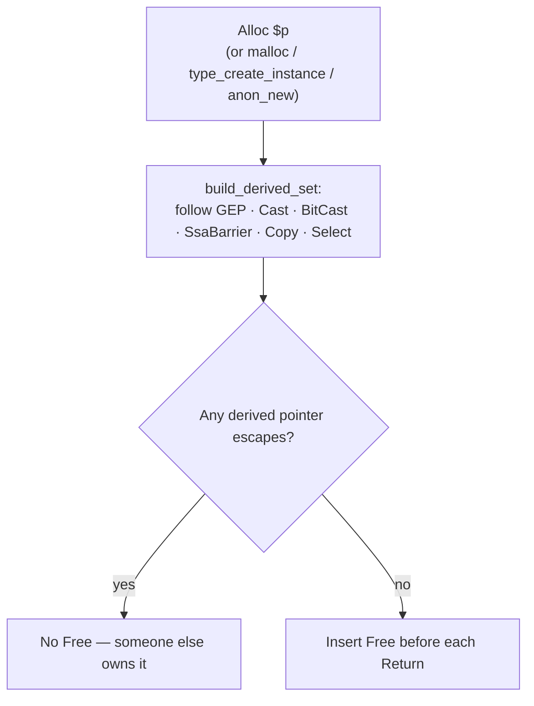
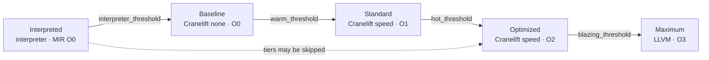

# Rayzor Architecture

Rayzor compiles Haxe to native code. It is a native code generator, not a
source-to-source backend: every backend emits machine code, WASM bytecode, or C
used as an assembler. **Language transpilation is an explicit non-goal** — the
official Haxe compiler already does that well, and there is no JavaScript target
and none planned.

What Rayzor adds over the official compiler is a tiered runtime and a single
optimization pipeline shared by every backend: code starts executing
immediately, and only what proves hot pays compilation cost.

---

## The pipeline



Each stage earns its place:

| Level | Preserves | Loses |
|---|---|---|
| AST | Source syntax verbatim | — |
| TAST | Syntax plus resolved types, symbol table, type table | — |
| HIR | Resolved types, ownership info, metadata as hints. Still structured: `ForIn`, `TryCatch`, `Switch`, labelled blocks, lambdas, interpolation | raw syntax |
| MIR | SSA over basic blocks with real phi nodes; type metadata carried down, not erased | structured control flow, names |

HIR still knows what the user wrote, so diagnostics and ownership analysis read
naturally there. MIR is flat and typed, so **one** optimization pipeline serves
every backend — that is the whole reason for the split.

`rayzor compile --stage {ast,tast,hir,mir,native}` stops at any level, which is
the cheapest way to see what each IR actually holds.

### Two pipeline drivers — know which one you are reading

`compiler/src/pipeline.rs` (`Pipeline::compile_file`) has tidy numbered stages
and reads like the reference implementation. **It is not what the CLI runs.**
Every command drives `compiler/src/compilation.rs` (`CompilationUnit`) via
`src/compile_helpers.rs`.

Three consequences that will otherwise cost you an afternoon:

- **Type checking is inline in `tast/ast_lowering.rs`**, not a separate phase.
  `tast/type_checking_pipeline.rs` has no caller outside `pipeline.rs` and tests.
- **Semantic graphs are not built on the production path.** `compilation.rs`
  passes `None /* No semantic graphs for now */` into HIR lowering. The layer is
  reached through `Pipeline::build_semantic_graphs` and the ownership check.
- Every CLI entry calls `PipelineConfig::skip_analysis()`, which disables
  lifetime, ownership, borrow checking, semantic analysis, HIR validation and
  flow analysis. Macro expansion is deliberately **not** disabled — it is a
  correctness feature, not analysis.

---

## Analysis: two systems, deliberately separate

User-facing diagnostics and compiler-internal analysis are different
subsystems, so error quality does not depend on optimizer internals or vice
versa.

- `tast/type_flow_guard.rs` — `TypeFlowGuard` orchestrates the CFG analyzer plus
  the lifetime and ownership analyzers, producing `FlowSafetyError`s
  (uninitialized variable, null dereference, dead code) that become user-visible
  warnings or errors.
- `semantic_graph/` — compiler-internal. TAST → CFG → DFG, plus a call graph and
  an ownership graph. The DFG is textbook SSA: dominance tree, phi placement from
  dominance frontiers, renaming, then phi-operand completion with type
  unification. Consumers gate on `is_valid_ssa()` before reading anything.

Two corrections to older documentation. MIR's SSA does **not** come from
`semantic_graph` — MIR builds its own with `IrInstruction::Phi`, and
`semantic_graph` never appears under `ir/mir/`. And the SSA optimization-hint
channel (HIR attributes → `SsaOptimizationHints`) exists end to end but is
inert: its only reader is a lowering entry point that is itself dead code. Treat
it as scaffolding.

### What actually rejects unsafe code

`CompilationUnit::check_ownership_violations` runs at the TAST stage: it builds
an `OwnershipGraph`, calls `check_use_after_move()`, then filters through
`TraitChecker`.

| Condition | Outcome |
|---|---|
| Type is `@:shared` (refcounted) | dropped — aliasing after `.clone()` is a refcount bump, not a move |
| Type is `@:move` | hard **error**, fails compilation; takes precedence over Copy |
| Type is Copy and not `@:move` | dropped — the graph records every reference as a move, so this removes false positives |
| otherwise | warning (E0382) with a "consider cloning" help |

MIR declares ownership vocabulary — `Move`, `BorrowImmutable`, `BorrowMutable`,
`Clone`, and an `OwnershipMode` per call argument — but nothing under `ir/mir/`
emits `Move` or either borrow, and nothing populates `arg_ownership`. It is
reserved vocabulary, not a live encoding.

---

## MIR

```
IrModule   { functions, globals, types, string_pool, extern_functions }
IrFunction { signature, cfg, locals, register_types }
IrBasicBlock { instructions, terminator, phi_nodes, predecessors }
```

Every collection is a `BTreeMap`, explicitly so iteration order is
deterministic — reproducible codegen depends on it. Do not swap in a `HashMap`.

Arithmetic is not one opcode per operator: it is `BinOp`/`UnOp`/`Cmp` carrying a
`BinaryOp`/`UnaryOp`/`CompareOp`. Calls are `CallDirect`/`CallIndirect`, field
addressing is `GetElementPtr`/`PtrAdd`, aggregates are
`CreateStruct`/`ExtractValue`/`InsertValue`, closures are
`MakeClosure`/`ClosureFunc`/`ClosureEnv`, enums are
`CreateUnion`/`ExtractDiscriminant`/`ExtractUnionValue`.

`ir/dump.rs` prints MIR in an LLVM-like textual form — registers `$N`, blocks
`bbN`, functions `fnN`, sorted by id so dumps diff cleanly. Note that
`RAYZOR_DUMP_MIR=1` fires **before** the optimization passes, so it is not what
the backend sees; use `rayzor dump --diff` for that.

### Lowering

HIR → MIR does three things at once, which is why it is the largest stage: it
flattens structured control flow into basic blocks, resolves HIR names to MIR
ids, and materialises what the source leaves implicit — boxing, drops, dispatch.
State lives in one `HirToMirContext` implemented across `ir/mir/`:

| Submodule | Role |
|---|---|
| `decl/` | what must exist before any body lowers: signatures, metadata, vtables |
| `stmt/`, `expr/`, `field/` | the lowering proper |
| `resolve/` | HIR names and symbols → MIR ids |
| `helpers/` | boxing, drops, allocation, type ids |

Call targets resolve by `SymbolId` in the local then external function map, then
fall back to matching the **fully-qualified name**. Bare-name matching is not
part of the contract: SymbolIds are per-context, so the FQN is the only identity
that legitimately crosses module boundaries.

Monomorphization runs on MIR *after* lowering and after the stdlib merge — so
generic specialisation sees SSA, and a bug in it presents as a MIR-level problem.

---

## Optimization

`PassManager::for_level` in `ir/optimization.rs` builds the pipeline; default is
O2. `InsertFreePass` is added **before the level match, at every level** — it is
a correctness pass, not an optimization.

| Level | Passes, in order (after InsertFree) |
|---|---|
| O0 | Inlining(15), DCE, UnreachableBlockElim, SRA, CopyProp, DCE |
| O1 | Inlining, DCE, Devirtualization, ConstantFolding, CopyProp, UnreachableBlockElim |
| O2 | O1 plus SRA, GlobalLoadCaching, BCE, GVN, CSE, LICM, LoopUnrolling, ControlFlowSimplify, DCE |
| O3 | O2 plus LoopVectorization and TailCallOpt |

Containment is not monotonic — O1 is the only level without SRA.

**O0 is not "no optimization."** It still forces inlining, because Haxe `inline`
is a language guarantee rather than a hint, and because inlining small
constructors is what exposes the Alloc+GEP shape that SRA needs. Without it,
per-iteration constructor allocations are never scalarised and loops leak.

The pipeline runs at most five times. A pass reporting `modified` only forces
another iteration if it is transformative; the three cleanup passes (DCE,
unreachable-block elimination, copy propagation) are excluded, so a round where
only cleanup fired terminates the loop.

### Ordering constraints

These are not stylistic — each one exists because the later pass cannot see what
it needs otherwise.



SRA is function-local, so constructor bodies must be inlined first. LICM's
`Alloc` handling runs last: escape analysis decides whether an allocation hoists
to the loop preheader with its `Free` sunk past the loop, reusing one buffer
across iterations.

`ir/escape_analysis.rs` is exactly that intra-loop question — it is **not**
general stack promotion. Object field decomposition belongs to SRA.

### InsertFree — the correctness backstop

HIR-level drop analysis only sees direct `new`, so this MIR pass catches factory
functions that return heap pointers.



A pointer escapes if it is returned, passed as a call argument, stored as a
value, placed into a `CreateStruct`, stored to a global, used in a memcpy, or
merged by a phi (conservative — SRA is expected to clean those up). Curated
exceptions exist for known-safe array ops and anon setters; string allocations
get a runtime release call rather than an `IrInstruction::Free`.

---

## Backends

| Backend | Module | Role |
|---|---|---|
| MIR interpreter | `codegen/mir_interpreter.rs` | Register-based (MIR is already SSA, so `IrId` maps straight to a register). Instant startup, tier 0 |
| Cranelift | `codegen/cranelift_backend.rs` | JIT tiers 1–3. Fast compile |
| LLVM | `codegen/llvm_jit_backend.rs`, `llvm_aot_backend.rs` | Default AOT path; also the top JIT tier and a whole-module upgrade |
| WASM | `codegen/wasm_backend.rs` + linker, component | MIR → core WASM → WASI P2 component. Linear memory, SIMD128 |
| C | `codegen/c_backend.rs` | MIR → C99 → gcc/g++ -O2. An LLVM-free AOT route |
| WGSL | `codegen/wgsl_transpiler.rs` | `@:shader` classes → WGSL at compile time. Not a general target |

AOT defaults to LLVM (`llvm-backend` is a default cargo feature); without it
`rayzor aot` errors rather than silently degrading. LLVM AOT prefers **system**
`opt` and `llc` over the linked LLVM, falling back to inkwell — and when system
tools are used, MIR O3 is capped to O2 because MIR GVN reorders floating-point
operations.

Cranelift fuses `fmul` feeding `fadd`/`fsub` into `fma`, but only within a single
Cranelift block. `RAYZOR_NO_FMA=1` disables fusion in instruction lowering,
Cranelift and LLVM alike, so a rounding discrepancy can be bisected across all
three.

---

## Tiered execution

Five tiers. The first four rungs are Cranelift; **`Maximum` is LLVM** — an
in-source comment claiming all JIT tiers are Cranelift is stale, contradicted by
`uses_llvm()` and by the LLVM queue that installs it.



Promotion compares tier ordinals, so a counter that clears several thresholds at
once skips rungs. Three different mechanisms own three different rungs:

- **Baseline** — compiled inline on the main thread.
- **Standard / Optimized** — routed to the `beadie` broker on a background
  thread, one adapter and bead registry per tier.
- **Maximum** — pushed onto an LLVM queue drained at the next `execute_function`
  entry, because LLVM's `add_global_mapping` must run on the main thread.

`sample_rate` does not skip counting — it samples only the promotion *check*, so
statistics stay accurate at any rate.

**The promotion barrier** is the safety-critical part. Function pointers cannot
be swapped while JIT code is running, so a HotSpot-style safepoint gates the
swap: the promoter CASes to `PromotionRequested`, waits for the in-flight
execution counter to drain to zero (one-second timeout, then cancel), swaps
pointers under a write lock, and returns to `Idle`. Installs are monotonic — a
pointer for a function already at a higher tier is dropped.

Two behaviours worth knowing before you benchmark:

- Every promotion compiles **all** modules into a fresh backend and leaks it.
  This is deliberate: per-function backends failed on cross-module calls, because
  compiling one module declares its callees as imports that cannot be resolved at
  finalize. Whole-module compiles make them internal symbols.
- **Only zero-argument functions actually run through a JIT pointer.** Argument
  marshalling from interpreter values to native types is unimplemented, so any
  function with parameters falls back to the interpreter even when a compiled
  pointer exists.

The MIR interpreter also cannot execute vector instructions; functions using SIMD
are pre-promoted to Baseline to avoid the bailout path.

Presets (`script`, `application`, `server`, `benchmark`, `development`,
`embedded`) select whole configurations, including whether promotion happens at
all. See [the CLI reference](../CLI.md) for the flags.

---

## Memory

There is no garbage collector. Cleanup is decided at compile time, and
`DropBehavior` has five variants:

| Variant | Meaning |
|---|---|
| `AutoDrop` | compiler emits `Free` — user classes allocated with `new` |
| `AutoDropWithDtor` | run the user's `drop()`, then `Free` — `@:derive(Drop)` |
| `ManualDrop` | `@:manualDrop`; never auto-freed |
| `RuntimeManaged` | runtime owns the lifetime — Thread, Channel, Arc, Mutex |
| `NoDrop` | primitives, arrays, Dynamic |

The HIR-level `DropPointAnalyzer` computes last use per variable, tracking loop
position, reassignment, block depth, and two escape sets — general escapes and
lambda captures, since a captured variable is owned by the closure and must not
be freed at scope exit.

Annotations recognised: `@:safety`, `@:managed`, `@:move`, `@:shared`,
`@:unique`, `@:borrow`, `@:owned`, `@:linear`, `@:affine`, `@:box`, `@:arc`,
`@:atomic`, `@:rc`, `@:manualDrop`. `@:safety` on the Main class sets a
program-wide mode: strict requires every class to be annotated, non-strict (the
default) auto-wraps unannotated classes in `Rc`.

`@:shared` is worth calling out: for extern classes whose ABI exposes both a deep
copy and an atomic increment, `.clone()` lowers to the increment, and
compile-time move tracking is suppressed because the refcount makes it safe at
runtime. `@:shared` and `@:move` on one class is a design conflict (W0030).

### Object layout

```
slot 0   __type_id : i64      ← stable name-hash class id
slot 1   first user field
...      every slot is 8 bytes
```

`alloc_size = max(16, slot_count * 8)`. There is **no vtable pointer in the
header** — dispatch resolves the vtable from the class id in slot 0, and
interface values are fat pointers wrapped at the `new` site.

`alloc_size_with_inheritance` takes the maximum over the whole `extends` chain at
the allocation site rather than trusting the size recorded at class registration:
an imported parent's fields may not have been visible when the subclass was
registered, and an undersized allocation lets inherited-field writes run past the
block. Over-allocating is safe because field indices do not move.

`@:cstruct` and `@:gpuStruct` classes get flat, headerless allocations for C and
GPU ABI compatibility.

Runtime type information is carried in MIR rather than erased, which is what
makes the slot-0 id meaningful downstream: `is`/`cast`, vtable and
interface-vtable lookup, `Type.getClass()` and Dynamic field access all compare
ids derived the same way at the allocation site and the check site, so they agree
by construction rather than by a mirrored offset transform.

---

## Runtime

Three crates, not one: `rayzor-runtime` (the native C-ABI surface — threading,
strings, exceptions, reflection), `rayzor-runtime-core` (`no_std + alloc`,
portable compute kernels shared with wasm), and `rayzor-runtime-wasm` (the guest
platform surface).

**Allocation.** `malloc`/`realloc`/`free` are extern declarations with no body;
MIR's instruction is `Free { ptr }` with no size. Each backend realises them
differently — Cranelift maps them to libc `FuncId`s, the LLVM JIT bakes the
registered libc address as a constant and calls indirectly (MCJIT leaves the
libcall relocation at zero on Linux), AOT lets the linker resolve them, and WASM
aliases them to `rayzor_obj_*` which store an 8-byte size header, because a
size-less `free` cannot drive a size-taking allocator.

**A MIR function is extern iff its CFG is empty.** This is load-bearing: a user
class with a `free()` or `malloc()` method shares the name by coincidence, and
binding a bodied function to the libc `FuncId` makes the backend try to define a
body over an import — which fails and installs a trap stub, so the method
silently never runs. Never match these by bare name.

**Stdlib calls** go through one registry keyed by
`MethodSignature { class, method, is_static, is_constructor, param_count }` —
param count is part of the key so overloads map separately. The value describes
the ABI: out-parameter, self-parameter, raw-value and sign-extension bitmasks,
authoritative parameter and return types. Two lowering shapes exist and which one
applies is data-driven, not a hardcoded class list: a direct extern call, or a
hand-built MIR wrapper with a real CFG for calls that need unpacking.

**Closure ABI** is `{ fn_ptr @0, env_ptr @8 }`. Separately, non-extern Haxe
functions receive a *trailing* env parameter, but only when they are an
indirect-call target or an entry point; extern and C-convention functions never
do. Call sites must agree — this is the classic source of arity mismatches.

**C ABI promotion**: on non-Windows targets, small integers are widened to i64 to
satisfy the platform ABI. The call site decides by reading back the declared
signature rather than re-deriving from the MIR type, so declaration and call
cannot disagree. A mismatch here is silent argument corruption.

Adding a runtime function: declare the extern in `haxe-std`, register the mapping
with `map_method!`, implement the `extern "C"` function (remembering the i64
widening), and `register_symbol!` it so the JIT can resolve it.

---

## On-disk formats

Three magics, all postcard-encoded, all in `ir/blade.rs`:

| Format | Magic | Holds |
|---|---|---|
| `.blade` | `BLAD` | one MIR module plus metadata and cached maps |
| symbol manifest | `BSYM` | pre-resolved stdlib symbols for fast startup |
| `.rzb` | `RZBF` | all modules, module table, entry point, build info |

Full layouts: [BLADE_FORMAT_SPEC.md](BLADE_FORMAT_SPEC.md) and
[RZB_FORMAT_SPEC.md](RZB_FORMAT_SPEC.md).

Two design points are worth stating here. **Cache invalidation uses three
independent keys**: a source content hash, the compiler semver, and a build id
stamped at compiler build time — the last exists because parser or MIR-shape
changes do not bump the semver, and without it a rebuilt compiler happily reads
caches whose layout it no longer understands. **Cached maps are keyed by name,
never by `SymbolId`/`TypeId`**, because ids are reassigned per compilation; this
is the same invariant that governs cross-module resolution generally.

`ir/tree_shake.rs` walks the call graph from the entry point and drops
unreachable functions, externs and globals before bundling, so stdlib the program
never calls does not ship. It runs outside the pass pipeline.

---

## Debugging

`rayzor debug` is a shipped toolkit: forensic run, multi-run bench, A/B compare
across git refs, PC-to-Haxe-function resolution, an lldb wrapper, and a live
metrics server with a browser dashboard. DWARF emission from Cranelift or LLVM is
**not** implemented — do not claim it.

Tier transitions can be traced with `RAYZOR_PROFILE_TIER_EVENTS`; see the
[CLI reference](../CLI.md) for the full environment-variable surface, and
`RAYZOR_DISABLE_PASSES` in particular for bisecting a miscompile without
rebuilding.
