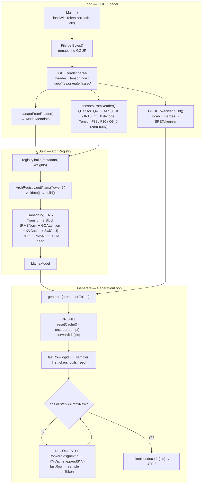
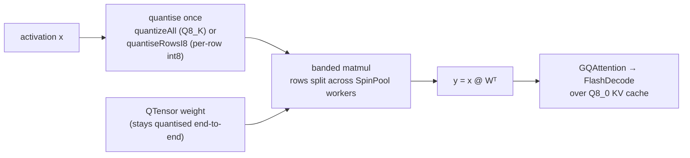
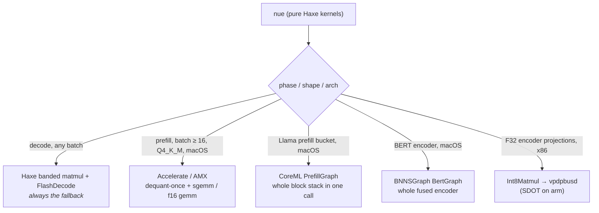

# nue Architecture

`nue` is the ML-inference framework that sits on top of Rayzor's compiler and
runtime. It exists to turn a quantised LLM checkpoint on disk into a stream of
tokens, with the same Haxe source compiling for native CPU/GPU and (eventually)
WebGPU+WASM. It is **inference-only** — no autograd, no training. Everything
above the runtime FFI is pure Haxe.

**The kernels are pure Haxe.** Quantised matmul (Q4_K_M / Q6_K / Q8_0 / INT8)
and decode attention run as Haxe band kernels in `Q4Matmul.hx` and
`FlashDecode.hx`, threaded over `rayzor.concurrent.SpinPool`. The Rust
`matmul_qt_t` / `flashAttnDecode` symbols still exist and are still reachable
(`NUE_MATMUL=0`, `NUE_HAXE_INT8=0`, …), but they are an **A/B reference, not the
target**: Rayzor is a Haxe runtime and Nue is its proof, so a Haxe-vs-Rust gap is
a work item against the kernel, the pool or the compiler — never a reason to
route a scheme back to Rust. FFI is reserved for genuine platform APIs
(AMX/Accelerate/CoreML) and for tensor construction/lifetime.

Current proof point (2026-07-27, M1 Pro, `bench_server.sh`, interleaved arms,
medians, census-verified `total ffi=0 (PURE HAXE)`):

| Model | pure Haxe | Rust reference |
|---|---|---|
| Qwen2.5-0.5B **Q6_K** | **125.69 tok/s** | 106.30 — Haxe **+18.2%** |
| Qwen2.5-0.5B **Q5_0 → INT8** | 113.82 tok/s | 119.37 — Haxe **−4.6%**, narrowing |

Llama 3.2 1B Instruct (Q4_K_M) measured **90.1 tok/s median decode** on the
2026-06-12 stack (tiers `1/30/5`, `start_interpreted=false`); that figure
predates the pure-Haxe kernel work and has not been re-measured since.
`rayzor aot` of the server reaches listening in 0.37s with ~0.6s cold TTFT (the
JIT pays 6-8s compile on a cold `.rayzor` cache). llama.cpp CPU tg128 on the
same machine measures ~95-103 (Metal: ~140).

Bench numbers are thermal-sensitive — this machine drifts up to **17% between
batches minutes apart**, so only **interleaved** ON/OFF/ON/OFF medians with
non-overlapping ranges count. See **[PERFORMANCE.md](PERFORMANCE.md)** for the
parity scorecard, the settled/refuted kernel questions, and the benchmarking
rules.

---

## Design Goals

- **One Haxe source, three deployment targets** — native CPU (Cranelift/LLVM
  JIT), native GPU (Metal/CUDA/Vulkan via `gpu/`), and browser (WGPU+WASM,
  in-flight). User code under `nue/` never branches on target.
- **Format-neutral architecture builders.** Loaders normalise everything to the
  GGUF tensor naming convention. `LlamaArch.build()` does not care whether the
  weights came from a GGUF, a safetensors file, or eventually an ONNX bundle.
- **Quantisation-aware composition without code duplication.** `Linear` and
  `Embedding` accept either an F32 `Tensor` or a `QTensor` (Q4_K_M, Q6_K) and
  dispatch through the matching runtime kernel. The arch builder picks the
  representation once at build time and the rest of the stack stays oblivious.
- **No autograd by design.** Adding a backward path would extend `Module` with
  a `backward(grad)` hook; forward semantics would not change. This is a v1
  scope decision, not a structural limit.
- **CPU-first, GPU-second, browser-third.** Every kernel exists as a CPU
  implementation; the GPU and WASM paths are layered as optional dispatchers
  through Rayzor's existing `gpu/` and `wasm_backend` infrastructure.

---

## Performance Levers — the Ledger

Decode throughput work is empirical here: every lever below was A/B-benched
(alternating pairs, cooldowns, sign tests; see `bench.sh` /
`bench_server.sh`, including its `SERVER_BIN=` mode for prebuilt AOT
binaries).

**Scope:** the table below is mostly *runtime-side* history — it records how the
Rust kernels and the worker pool got fast. The pure-Haxe kernels that now serve
those schemes, and how close each is to parity, live in
**[PERFORMANCE.md](PERFORMANCE.md)**.

Rules learned the hard way:

- **Microbench the actual overhead before building.** Four llama.cpp-mirroring
  attempts washed out because the overhead they amortised was assumed, not
  measured.
- **Never compare profiled and unprofiled runs.** `DECODE_PROFILE=1` costs
  2-3 tok/s; `RZT_KERNEL_TIMING=1` ~7%. Use them for fractions, not walls.
- **Scrub `.rayzor` caches after any compiler rebuild** before a
  `NO_CACHE=false` bench — stale BLADE caches poison imports.

### Landed (measured wins)

| Lever | Gain | Where |
|---|---|---|
| Fused flash-attn decode kernel | +40.7% | `rayzor_tensor_flash_attn_decode` |
| JIT trap-stub/inlining fix | +71.7% long-form (correctness-as-perf) | compiler 655d7ac |
| llama.cpp NEON Q4_K kernel port | +15.4% | quant.rs (RZT_LEGACY_KERNEL=1 reverts) |
| FFI-batched top-k scan | +23% canonical / +3% long | `rayzor_tensor_topk_scan` |
| NEON SIMD top-k scan | +6.3% | same kernel |
| Persistent spin-wait worker pool | condvar → >70 tok/s steady | worker_pool.rs (RZT_LEGACY_POOL=1) |
| Q4_K_M SDOT 4-way partial-acc unroll | +1.4% short / +7% long | quant.rs |
| Q4_K_M 2-block paired SDOT (register tiling) | +3.0% | `dot_q4_k_q8_kblock_2` |
| flash-attn per-q_head parallelisation | +4.5% at long context | gated cache_len ≥ 256 |
| lm_head requant Q6_K → Q4_K_M | ~+21% on long-form | `NUE_REQUANT_LM_HEAD` (default on) |
| Fused QKV projection | 1 dispatch + 1 activation-quant for q/k/v | `fusedQkvMatmul` (Rust reference) |
| Prefill morsels | prefill 0.64s → 0.23s | `RZT_PREFILL_MORSELS=1` |
| Tier tuning `1/30/5`, `start_interpreted=false` | ~70-74 → ~81 band | rayzor.toml (locked in) |
| Caller-assist fork-join | +0.5%, frees a P-core | worker_pool.rs (RZT_NO_CALLER_BAND=1 reverts) |
| QoS-pin orchestrator + GQA per-token frees | ~+3 tok/s (AOT) | worker_pool.rs + GQAttention.hx |
| Pool-wide `auto_kernel_threads` | unblocks RZT_WORKERS sweeps | was 5× hardcoded 6 |
| AOT compilation of the server | cold TTFT 8.4s → 0.56s; decode parity | `rayzor aot` (manifest mode) |
| Q8_0 KV cache | 3.76× smaller KV; parity at short ctx, expected win >4k | `NUE_KV_Q8=1` (opt-in) |
| NEON q8_K activation quantizer | +2.5 tok/s median (ABBA), bit-identical (FCVTAS ties-away = roundf) | runtime-core q8_k.rs |
| Prefill morsels default ON | bare deployments no longer 2.8× slower prefill | `RZT_PREFILL_MORSELS=0` opts out |
| **Pure-Haxe quantised bands (Q4_K/Q6_K/Q8_0/INT8)** | replaces the Rust matmul as the default path | `Q4Matmul.hx` (`NUE_MATMUL=0` A/Bs) |
| **Q8_0 native zero-copy weights** | Qwen Q6_K 10 → 85 tok/s (152k lm_head was Q8_0-in-F32) | loader + `q8Banded` |
| **SpinPool const-reassign box leak fix** | ~1GB/request → flat RSS | `SpinPool.hx` (e6e67eb7) |
| **All-INT8 triple fusion** (one shared activation quantise) | +21.3% / +25.0% Q5_0 | `matmulFused` (a1dc2c87) |
| **Fused single-dispatch banding** (joined row space) | +13.2%; pool dispatches −49.7% | `int8BandedFused` (584df55f) |
| Hot-path env::var hoist | ~490 env-lock hits/token removed | `llamacpp_kernel_enabled()` OnceLock |
| Dynamic chunk stealing | variance: σ 33.6→1.5, min 7.6→80.9 on busy box; median +9 vs static bands same conditions | worker_pool.rs (`RZT_STATIC_BANDS=1` reverts) |

### Refuted (do not retry without changed conditions)

| Attempt | Result |
|---|---|
| Static 8-band fan-out + spinning caller | **2.3× collapse** — 9 runnable on 8 P-cores, E-core straggler gates every join |
| Compute width 7 → 8 (with caller assist) | +0.1% and fragile; 6 → 7 was +0.5%. DRAM-pattern-bound, not core-bound |
| ggml-style per-layer mega-dispatch | below the line — marginal join cost measured ~1-2µs × 97 joins/token ≈ 0.15ms |
| SwiGLU gate+up fusion | -0.2%; per-op sync was 10-30µs, not 100µs |
| Q4_K_M 2-row SDOT tile; 4-block pairing; Q6_K SDOT; Q6_K 8-way unroll | each washed out or regressed — M1 OoO/prefetch already saturated at those widths |
| F32 flash-attn GQA restructure | tie — L1 absorbs the redundant K/V loads |
| mpsc → atomic-countdown fork-join | wash; std::mpsc already tuned |
| TensorPool default-on | 65% hit rate, +0.3% sub-noise; alloc ceiling is 0.5-2.3% of wall (stays opt-in `RZT_POOL=1`) |
| `-O3` AOT | no change vs `-O2` |
| ggml 4×8 repack GEMV | refuted on M1 Pro — llama-bench ABBA sign 3-3, median +0.4 within noise; port killed at zero LOC |
| NEON silu (vector exp) | 0-3 ABBA pairs; true scalar cost ~0.1ms/token (KERNEL_TIMING had inflated it); in tree behind `RZT_NEON_SILU=1` |
| Speculative decoding (on CPU) | pre-refuted by measurement: prefill GEMM is only 12% cheaper per token than decode GEMV (compute-bound at batch>1) — batch-verify pays only on GPU |

### Open levers (current state of the hunt)

Re-derived 2026-07-27 against the pure-Haxe kernels. The step budget is ~8.9ms
at 112 tok/s (Q6_K) and ~10.6ms at 94 tok/s (Q5_0/INT8). Measured split on a
300-token INT8 request: **band ~77% of the request**, activation quantise
**0.1%** (`quant_ms=3.4` vs `band_ms=2151.7`), sampler **12-13% of wall**.

The earlier claim that "dispatch overhead is measured to exhaustion" was
**wrong** — halving pool dispatches (55366 → 27862) was worth **+13.2%** in
2026-07. Assume nothing here is exhausted without a fresh interleaved A/B.

What remains, ranked by evidence:

1. **INT8 band parity (−18.9% vs the Rust reference).** The top open item, and
   the only scheme not at parity. Already ruled out: the inner-loop shape (ours
   is 5.6% *faster* than `dot_i8_i8`'s), dispatch count (halved), the activation
   quantise (0.1%), `scheme()` FFI traffic (~0.02%). Unexamined: weight
   streaming / cache blocking over rows×K, `fusedQkvIntoArr`'s single-pass
   traversal, the per-row scale-load + f32 store tail. See PERFORMANCE.md.
2. **Pool scheduling variance.** The Haxe INT8 arm swings 84.4 / 94.5 / 96.4
   across identical runs while the Rust arm holds 116.1 / 116.5 / 116.7
   (σ≈0.3). A 14% swing in one arm and none in the other implicates work
   distribution / spin-park policy rather than the kernel — plausibly worth
   more than any kernel change, and it may be *why* the INT8 median lags.
3. **Sampler cost.** 1.26 ms/token, 12-13% of wall, identical in both arms and
   independent of quant scheme (151,936-vocab logits + repetition penalty +
   no-repeat-8gram). A pure-Haxe win available regardless of matmul work.
4. **Prefill.** Now quantified: **1.9× slower than the Rust reference** (0.077s
   vs 0.041s per 150-token run). ~5% of wall on short prompts, dominant on long
   ones — i.e. the server workload. Prefill is the one matmul with weight reuse,
   so cache blocking is the real tiling target.
5. **Metal/GPU decode.** llama.cpp Metal at ~140 tok/s on this hardware is
   the existence proof for a ~1.7× leap; rayzor's `gpu/` crate (KernelIR,
   MSL/WGSL codegen, wgpu) is the substrate. Also the path that converges
   with the WebGPU/WASM edge story. Being scoped.
6. ~~Dynamic chunk stealing~~ — LANDED as the variance fix (see ledger);
   the earlier "median-neutral" call was made before caller-assist created
   an exclusively-owned band that a stalled caller could strand.
7. **Decode-loop alloc churn**: ~490 frees/token remain after the GQA fixes;
   bounded at 0.5-2.3% of wall by the arena measurement — cleanup value,
   not a throughput lever. (Distinct from the 2026-07 SpinPool box leak, which
   was ~1GB/request and is fixed; see PERFORMANCE.md for that bug class.)
8. **Prefix-cache KV reuse (RadixAttention-lite)** — a TTFT lever for
   multi-turn / shared-prefix serving, *not* a decode-tok/s lever, and it
   does NOT pay off until the reuse workload exists. Today every
   `generate()` calls `model.resetCache()` (GenerationLoop.hx) and the chat
   server is strictly sequential with a fresh loop + re-tokenised template
   per request — no multi-turn, no persistent session, no batching, and the
   system prompt (the obvious shared prefix) is disabled on the 1B for
   precision drift. So a prefix cache would cache a prefix and immediately
   throw it away. **Sequence: build the workload, then the cache.**
   - **Stage 0 — session state** in `llama-chat-server` so a conversation's
     turns accumulate (system+history reused turn to turn). ~1-2 days, pure
     Haxe app layer. This is the actual precondition.
   - **Stage 1 — radix-lite** (~3-6 days): make `resetCache()` optional +
     add a `startPosition` to `forwardIds` (threaded through
     `GQAttention.forward → KVCache` so a turn prefills only its divergent
     suffix while reused rows stay) + a per-session longest-token-prefix
     compare (the "radix walk" degenerates to one prefix-compare for
     single-session multi-turn). Rides the EXISTING contiguous KV, the
     EXISTING zero-copy `slice` view, the EXISTING absolute RoPE (already
     position-offset driven, RoPE.hx), and the **UNCHANGED** flash kernel.
     Win = skip a full prompt-length re-prefill per turn (e.g. ~2000-token
     history → first token near-instant). Works on **both native and wasm**
     (wasm rides the same runtime-core kernel; persisting one session's KV
     is ~9 MB Q8 — trivial).
   - **Do NOT build vLLM PagedAttention.** Its payoff (KV fragmentation +
     dynamic batching across many concurrent in-flight sequences) targets a
     regime nue's sequential server cannot express; it needs a block-table
     allocator + a gather-capable kernel rewrite replicated across native
     F32/Q8 and wasm/host-Q8 (the flash kernel HARD-REJECTS non-canonical
     strides), and on wasm it *worsens* the 2 GiB linear-memory pressure the
     reclamation work just contained (more cached prefixes = more resident
     KV near the 2^31 wall). Revisit only if concurrent batched serving is
     built. Correctness traps for the lite path: RoPE absolute-position
     alignment (reused prefix valid only if the suffix decodes at the SAME
     positions) and a complete invalidation key (token-ids + model +
     positions, not text).

### Decode vs prefill split

**Decode stays on the fused/spin-pool path** — single-token GEMV has no
weight reuse, so the wins are register tiling, fused kernels, fewer bytes,
and keeping all eight P-cores computing (caller assist). **Prefill gets the
parallel structure** — multi-token GEMM has rows to amortise; morsels landed
(`RZT_PREFILL_MORSELS`), cache-blocked micro-kernels are the open follow-on.

### NueGraph execution plans

Stage 1 shipped, and it is smaller than the section that used to sit here
predicted. There is no graph IR that generation walks. What exists is a
**build-time plan**: `nue.arch.NuePlan` records the structure and policy a model
was actually built with, and each layer's routing decision is lowered onto the
module the kernel already has in hand.

The shape, and the constraints behind each choice:

- **`NuePlan` is a local, not a field.** It is constructed inside
  `LlamaArch.build()`, dumped, and dropped. `LlamaModel` gained no field for it,
  because a `Null<>` field holding a nue-defined class has an open corruption
  record. The cost is that `prefillHandle` is attached later by the loader, so
  the dump says `graph_prefill=deferred`.
- **It lives in `nue.arch`, beside its builder.** No new package, no new
  directory. `LlamaArch` performs every field read and passes primitives in, so
  `NuePlan` reads no foreign field.
- **Policy travels as an `Int` on the receiver.** `GQAttention.planHaxeMat`,
  `planFusedQkv`, `SwiGLU.planHaxeMat`, `planFusedPair`, `LlamaBlock.planDbgShape`
  and `planDecodeSplit`. No kernel reads the plan; nothing new crosses a module
  boundary on the hot path.
- **Zero means unplanned, and it is load-bearing.** A module built outside the
  builder — the two standalone examples do exactly that — holds zero and decides
  its route at the call site exactly as before. That is why the states are
  1 and 2 rather than a boolean, and it is why the examples needed no edit.
- **New instance fields are appended, never inserted.** Importers resolve fields
  by declaration order.
- **`Q4Matmul` was not edited at all.** Its `matmul` / `matmulFused` /
  `noteFusionSite` / `dumpPlan` signatures are frozen, the seven private kernel
  gates stay kernel-owned, and `dumpPlan()`'s gates line remains the sole
  authority for them.

The acceptance bar was bit-identical behaviour with identical dispatch counts,
and it was met at every step: arm A output — plan, census, cache, dispatch count
and generated text — is byte-identical from before Stage 1 to after it. The only
permitted deltas are the added `[nue-graph]` block and the position of the single
`[q4-gate]` line, which moves because its print is a first-read side effect and
the first read relocated to build time.

Before the verification scaffold was removed, the planned route was compared
against the live expression on every forward across all 64 combinations of the
six fusion gates, on two models: 128 runs, zero mismatches.

What is deliberately **not** here: no `forwardLayers` hot-loop rewrite (it buys
nothing while one layer kind exists, and touches an aliased in-place residual),
and no node vocabulary that generation consumes. The passes below remain future
work.

The first useful passes are:

1. **Prefill/decode split planning**: select separate kernels and scheduling
   strategies for multi-token prefill and single-token decode.
2. **Fusion planning**: make QKV, gate+up, residual/add, small-batch Q8 flash,
   and future norm/linear boundaries systematic instead of hand-wired per arch.
3. **Memory planning**: compute tensor lifetimes, view ownership, reusable
   scratch regions, KV layout, logits buffers, and early-free points before
   running the model.
4. **Placement planning**: choose CPU spin-pool, LLVM tier, runtime FFI, or GPU
   kernels per node based on dtype, shape, context length, and host capability.
5. **Serving plans**: express session KV reuse, prefix-cache policy,
   speculative verifier paths, and warm-worker plan caches for `.rzb`, AOT, and
   server deployments.

This is primarily a stability and planning layer: it should reduce accidental
temporary tensors, make fusions portable across model families, and give the GPU
path a single place to make placement decisions. It is not expected to double
NUC decode throughput by itself; the core decode limit remains Q4 matmul
bandwidth and kernel density. The value is that it makes the next bandwidth and
placement wins composable instead of one-off.

---

## Foundations: the Module Protocol

Every learnable layer in nue implements `nue.Module`
([nue/Module.hx](nue/Module.hx)):

```haxe
interface Module {
  function forward(x:Tensor):Tensor;
  function parameters():Array<NamedTensor>;
}
typedef NamedTensor = { name:String, tensor:Tensor }
```

`parameters()` exists for the loader↔module-tree wiring contract: each
`NamedTensor` carries a canonical GGUF-style name (e.g. `blk.7.attn_q.weight`)
that the arch builder uses to fetch the corresponding tensor out of
[NamedTensorMap](nue/model/NamedTensorMap.hx).

Two model-shape interfaces specialise `Module`:

| Interface | File | Role |
|---|---|---|
| `CausalLanguageModel` | [nue/CausalLanguageModel.hx](nue/CausalLanguageModel.hx) | Autoregressive decoders. Adds `forwardIds(Array<Int>)` for token-stream input and `resetCache()` for KV-cache lifecycle across prompts. |
| `EncoderModel` | [nue/EncoderModel.hx](nue/EncoderModel.hx) | Bidirectional encoders (BERT-family). Adds `encode(Array<Int>)` for full-sequence processing. No cache. |

Concrete root-level implementations:

- [Linear.hx](nue/Linear.hx) — `weight ∈ {Tensor F32, QTensor Q4_K_M}` + optional bias. The
  quantised path goes through `tensor_matmul_qt_t_f32_threaded`; the F32 path
  through `tensor_matmul_t`. Bias is added in place. A 1×1 F32 sentinel tensor
  is held alongside the QTensor in `fromQuant()` to keep class layout stable
  (works around a JIT bug with null `Tensor` fields in large import graphs).
- [Embedding.hx](nue/Embedding.hx) — token-lookup table. F32 path uses
  `tensor_gather_rows`; Q6_K path uses `qtensor_gather_rows_q6_k`, which
  dequantises **only the rows touched by the prompt** rather than the full
  `[vocab_size × hidden_dim]` table. `embedTable()` returns `Dynamic` so the LM
  head can tie weights regardless of whether the embedding is F32 or
  quantised.
- [BertModel.hx](nue/BertModel.hx) — full BERT encoder composition. Sole
  built-in `EncoderModel` concretion; instantiated by `BertArch.build()`.

---

## Subsystem Roles

### `model/` — format-neutral abstractions
[ModelLoader.hx](nue/model/ModelLoader.hx) is the loader contract:
`readMetadata()`, `readNamedTensors()`, and a `load()` convenience. It is the
single interface that `GGUFLoader`, `SafetensorsLoader`, and `ONNXLoader`
(stub) all implement.

[ModelMetadata.hx](nue/model/ModelMetadata.hx) is a typedef for
architecture-agnostic hyperparameters: `architecture` name, `hiddenSize`,
`numLayers`, `numHeads`, `numKvHeads`, `headDim`, `vocabSize`, `maxSeqLen`,
`normEps`, `ropeBase`, `tieWordEmbeddings`, plus an `extras:Map<String,Dynamic>`
escape hatch for per-format knobs (quant scheme, op-set version, etc.) that do
not belong in the core schema.

[NamedTensorMap.hx](nue/model/NamedTensorMap.hx) is the weight dictionary:
parallel `tensorByName : StringMap<Tensor>` and `qtensorByName :
StringMap<QTensor>` maps with insertion-order preservation so per-layer
iteration matches the GGUF tensor index order arch builders expect. The dual
storage is what makes the quantisation-preserving path work — Q4_K_M and Q6_K
weights never get dequantised to F32 on the way to module construction.

This subsystem has **zero FFI dependencies**.

### `loader/` — file-format ingestion
Three concrete `ModelLoader` implementations plus a GGUF tokenizer extractor.

| File | Role |
|---|---|
| [GGUFReader.hx](nue/loader/GGUFReader.hx) | Low-level GGUF v3 parser. Reads magic/version, the metadata KV table, and the tensor index. Splits 64-bit file offsets into lo/hi 32-bit pairs (via `Bytes.subWithBase`) to handle >4 GiB files without sign-extension. `TensorInfo` is modelled as a class, not an anon typedef, to dodge a JIT dispatch bug with interface-typed array elements. |
| [GGUFLoader.hx](nue/loader/GGUFLoader.hx) | High-level GGUF ingestion. Parses metadata into `ModelMetadata`, decodes tensor data per dtype (Q4_K_M/Q6_K → QTensor via `qtensor_from_bytes_*`; F32/F16/Q8_0 → Tensor via `tensor_fromBytes*`), registers everything in `NamedTensorMap`. The `loadWithTokenizer()` convenience returns `{model, tokenizer, metadata}` in one shot. |
| [GGUFTokenizer.hx](nue/loader/GGUFTokenizer.hx) | Extracts BPE vocab + merges from GGUF metadata (`tokenizer.ggml.tokens`, `tokenizer.ggml.merges`) and constructs a `BPETokenizer`. Knows where to look in the metadata KV table. |
| [SafetensorsLoader.hx](nue/loader/SafetensorsLoader.hx) | JSON header + binary tensor data. Normalises HuggingFace tensor names (`model.layers.{L}.self_attn.q_proj.weight`) to GGUF canonical (`blk.{L}.attn_q.weight`) on entry, so arch builders see one naming scheme regardless of source format. Reads companion `config.json` for `ModelMetadata`. |
| [ONNXLoader.hx](nue/loader/ONNXLoader.hx) | Stub. Lowest priority; placeholder so `ArchRegistry` can dispatch on architecture+format without `match` going non-exhaustive once it lands. |

### `tokenizer/` — text ↔ token IDs
Pure-Haxe BPE implementation. **No FFI calls** — entirely `haxe.io.Bytes` and
`haxe.ds.StringMap`.

| File | Role |
|---|---|
| [Tokenizer.hx](nue/tokenizer/Tokenizer.hx) | Interface: `encode(String):Array<Int>`, `decode(Array<Int>):String`, plus vocab introspection and special-token registry. |
| [BPETokenizer.hx](nue/tokenizer/BPETokenizer.hx) | Concrete BPE: longest-prefix-first special-token scan (atomic pass-through for `<|begin_of_text|>` etc.), GPT-2-style byte-level encoding through a 256-entry printable-Unicode table, O(1) merge rank lookup via `StringMap<(left,right) → priority>` for the merging hot loop. UTF-8 codepoint decoding is explicit (not `charCodeAt`, which would index bytes). |
| [Vocab.hx](nue/tokenizer/Vocab.hx) | Bidirectional token-string ↔ id map with optional per-token scores. |
| [MergeRule.hx](nue/tokenizer/MergeRule.hx) | Single BPE merge rule (left, right, merged, precomputed concatenation key). |

A known gap (flagged in source): there is no regex pre-tokenisation; inputs go
into the BPE loop as a single chunk. This causes 1–2 token divergence from
`llama.cpp` on complex prompts (the matter is documented in
`bugs_llama_chat_match_overstated`).

### `arch/` — architecture builders
The bridge between format-neutral loaders and instantiated module trees.

```haxe
interface ArchBuilder {
  function name():String;
  function validate(meta:ModelMetadata):Void;     // throws on shape mismatch
  function build(meta:ModelMetadata, weights:NamedTensorMap):Module;
}
```

[ArchRegistry.hx](nue/arch/ArchRegistry.hx) is an **instance-based** registry
(not static — dodges JIT flakiness with global mutable state). `withDefaults()`
returns a Llama-family registry (`llama`, `qwen2`, `mistral`) so source-run
cold starts do not lower BERT encoder code for causal-LM apps. Use
`BuiltinArchRegistry.withDefaults()` when an application wants every built-in
architecture, including BERT. The internal `ArchEntry` caches each builder's
`name()` at registration time because calling the interface method later (when
the receiver is typed as `ArchBuilder`, not the concrete class) has hit JIT
dispatch bugs in this codebase.

| File | Role |
|---|---|
| [LlamaArch.hx](nue/arch/LlamaArch.hx) | Wires Llama/Mistral/Qwen2: embedding (Q6_K if available, else F32) + N `TransformerBlock`s containing pre-`RMSNorm` + `GQAttention` + per-layer `KVCache` + pre-`RMSNorm` + `SwiGLU` + residual, then output `RMSNorm` + LM head (weight-tied to embedding when `tie_word_embeddings=true` or `output.weight` is absent). |
| [BertArch.hx](nue/arch/BertArch.hx) | Wires BERT/RoBERTa/DeBERTa encoders: token + position + segment embeddings, post-`LayerNorm`, N transformer blocks with `MultiHeadAttention` + `GeluFFN`, optional final `LayerNorm`. |
| [LlamaModel.hx](nue/arch/LlamaModel.hx) | The concrete `CausalLanguageModel` returned by `LlamaArch.build()`. `forwardIds()` routes through embedding lookup → block stack → final norm → LM head, producing `[seq_len, vocab_size]` logits. `resetCache()` walks the block array and resets every layer's `KVCache.currentLen` to 0. |

Two opt-in optimisations are gated by env vars in `LlamaArch`:

- `NUE_KV_Q8=1` → KV cache uses Q8_0 storage (3.76× memory reduction, see
  `bugs_q8_kv_cache_attempted` for the parity discussion).
- `NUE_REQUANT_LM_HEAD=1` → when the embedding is Q6_K and the LM head ties
  to it, build a Q4_K_M view of the table via
  `qtensor_requant_q6k_to_q4km` so the LM head's SDOT path is faster (Q4_K_M
  has lower per-block dequant overhead than Q6_K).

### `transformer/` — building blocks
This is where the kernel-heavy work lives. Every layer here is a `Module`.

| File | Role |
|---|---|
| [TransformerBlock.hx](nue/transformer/TransformerBlock.hx) | Generic pre-norm residual block. Parametric over `attn:Module` and `ffn:Module`, so the same container drives Llama (`GQAttention + SwiGLU`) and BERT (`MultiHeadAttention + GeluFFN`) without branches. Residual addition is in-place (`x.addInto(attnOut)`) — saves one `[seq, hidden]` F32 allocation per block per token, but assumes `x` is a fresh owning tensor from upstream. |
| [GQAttention.hx](nue/transformer/GQAttention.hx) | Decoder attention (Llama-family). Owns `RoPE` tables and a per-layer `KVCache`. Fuses three independent Q/K/V Q4_K_M matmuls into one when all three projections are Q4_K_M (cuts fork-join overhead 3×). Decode-path single-token dispatches go directly to `rayzor_tensor_flashAttnDecode` (or `flashAttnDecodeQ8` when the KV cache is Q8) — this skips the intermediate `expandKvHeadsAxis1` allocation that would otherwise eat ~147 MB/token at 16 layers. Prefill (multi-token) still goes through the unfused `expand → bmm → softmax → bmm` chain. |
| [MultiHeadAttention.hx](nue/transformer/MultiHeadAttention.hx) | Encoder attention. Strict superset-free of `GQAttention`: no GQA repeat, no causal mask, no KV cache. |
| [KVCache.hx](nue/transformer/KVCache.hx) | Append-only K/V buffer with dual F32/Q8_0 storage modes (`useQ8` field). Owns the underlying tensors; `currentLen` tracks the row count of valid data. Prefill writes all prompt tokens at once; decode appends one row per step via `rayzor_tensor_appendAlong0`. Never reallocates — buffer size is preallocated to `maxSeqLen` at build time. |
| [KvCacheQ8.hx](nue/transformer/KvCacheQ8.hx) | Extern opaque class for the Q8_0 storage variant. Dequantisation is either streamed inside `flashAttnDecodeQ8` (decode path) or materialised on demand by callers that need a full F32 view (prefill rarely takes this path). |
| [RoPE.hx](nue/transformer/RoPE.hx) | Precomputed `cos`/`sin` tables (`rayzor_tensor_ropeCosTable` / `ropeSinTable`), applied per-token to Q and K via `rayzor_tensor_rope`. |
| [RMSNorm.hx](nue/transformer/RMSNorm.hx), [LayerNorm.hx](nue/transformer/LayerNorm.hx) | Normalisation variants for the two model families. Per-channel learnable gain (and bias for LayerNorm). |
| [SwiGLU.hx](nue/transformer/SwiGLU.hx), [GeluFFN.hx](nue/transformer/GeluFFN.hx) | The two FFN variants. SwiGLU is three projections (`gate`, `up`, `down`) with `silu(gate(x)) * up(x)` then `down(...)`. GeluFFN is the classical two-projection GELU pattern. |

### `sampling/` — token selection + the generation loop

[Sampler.hx](nue/sampling/Sampler.hx) is the strategy contract:
`function sample(logits:Tensor):Int`. **Stateless per call** — each invocation
receives a fresh logits tensor and returns a token id. Stateful sampling
(repetition penalty, sliding windows) is implemented as a wrapper sampler that
owns the state, calls into a stateless inner sampler, and mutates the logits
before delegating. `llama-chat`'s `LocalTempSampler` is an example.

| File | Role |
|---|---|
| [ArgmaxSampler.hx](nue/sampling/ArgmaxSampler.hx) | Deterministic greedy max. |
| [TemperatureSampler.hx](nue/sampling/TemperatureSampler.hx) | Temperature-scaled softmax with an embedded 31-bit LCG RNG state. |
| [TopKSampler.hx](nue/sampling/TopKSampler.hx) | Selection-sort over logits to the top K candidates, then temperature softmax over the nucleus. |
| [TopPSampler.hx](nue/sampling/TopPSampler.hx) | Insertion-sort descending by probability, cumulative-mass cutoff. |
| [GenerationLoop.hx](nue/sampling/GenerationLoop.hx) | The autoregressive driver. Owns the prefill→decode lifecycle, the streaming callback, and the explicit `.free()` calls that prevent logits accumulation across decode steps. Optional wall-time profiling via `NUE_PROFILE_DECODE=1` breaks down `fwd / lastRow / sample / decode_str / free`. |

All three stochastic samplers pre-allocate `Array<Float>` and assign by index
instead of using `Array.push` because of a Haxe JIT bug in `Array<Float>.push`
read-back.

---

## End-to-end Runtime Flow

Process start to streamed tokens. File references only — no line numbers, they
go stale faster than the prose.



Inside one forward pass, the quantised projections and decode attention are the
**pure-Haxe kernels** — `Linear` routes `QTensor` weights through `Q4Matmul`
(`runBanded` / `q8Banded` / `int8Banded`, banded across `SpinPool`), and
`GQAttention` runs `FlashDecode` over the Q8 KV cache:



Fused triples (Q/K/V sharing the post-attn-norm activation, gate/up sharing the
post-FFN-norm one) quantise that activation **once** and — for all-INT8 — band
their **joined row space in a single pool dispatch**.


## Cross-cutting Concerns

### Quantisation strategy
`nue` is built around the assumption that quantised weights stay quantised
end-to-end:

Every scheme below is banded by a **pure-Haxe kernel** in `Q4Matmul.hx`
(`runBanded` for the k-quants, `q8Banded`, `int8Banded`), dispatched over
`SpinPool`. The Rust `matmul_qt_t` symbols remain as the A/B reference.

- **Q4_K_M** — projections inside `Linear` (attention QKV, FFN gate/up/down, LM
  head when re-quantised). Banded in Haxe against a Q8_K activation quantised
  once per call by `quantizeAll`; the SDOT inner shape follows `llama.cpp`'s
  NEON pattern.
- **Q6_K** — token embeddings and (by default) the LM head when tied. Row
  dequantisation is selective: `qtensor_gather_rows_q6_k` only decodes the
  rows touched by the prompt, not the full `[vocab, hidden]` table.
- **INT8** — per-row symmetric, produced by decoding Q5_0/Q5_1 at load
  (`decodeQ5_0Int8`). Banded by `int8Banded`/`int8DotRow` (4 accumulators,
  64-wide step — measured **faster than** runtime-core's 2-accumulator
  `dot_i8_i8` shape). An all-INT8 triple shares one activation quantise and
  bands its **joined row space in a single pool dispatch**
  (`int8BandedFused`).
- **Q8_0** — native weight storage (zero-copy from GGUF, banded by `q8Banded`),
  and opt-in KV cache storage (`NUE_KV_Q8=1`). Decode attention runs the Haxe
  `FlashDecode` path over the Q8 cache.
- **F32 / F16** — fallback path. Used when no quantised weight is present in
  the file.

The `ModelMetadata.extras` map carries per-format quant hints (GGUF's
`general.quantization_version`, etc.) so arch builders can specialise without
schema growth.

### Tensor lifetime and explicit `.free()` calls
Rayzor's `InsertFreePass` does not currently recognise extern tensor returns
as owned values that need cleanup. Until it does, every layer that receives a
tensor from an FFI call is responsible for calling `.free()` on intermediates
it does not return. The most visible places this shows up:

- `GenerationLoop.generate()` — `logits.free()` per decode step. Without it,
  ~512 KB × ~600 tokens = ~300 MB of orphaned logits per generation.
- `GQAttention.forward()` — every intermediate (`q`, `k`, `v`, projected
  Q/K/V, masked scores, context) is freed after the residual write.
- `BertModel.encode()`, `Linear.forward()` — clone/free pairs around
  branching paths so the strict E0382 move checker is satisfied without
  losing ownership.

This is also why the `bugs_decode_loop_per_step_leak` debugging arc landed
where it did — the flash-attention fix (commit `7835a26`) was the structural
fix that removed the largest source of per-token bytes; the spin-pool fix
(commit `4001079`) removed the residual channel-allocation tail.

### KV cache lifetime
`KVCache` instances are constructed once per layer inside
`ArchBuilder.build()` and **stay resident for the life of the model**. They
are never freed or reallocated mid-run. `currentLen` tracks how many rows are
valid:

- `GenerationLoop.generate()` calls `model.resetCache()` once at the start.
  This walks the block array, downcasts each to `TransformerBlock` (an
  explicit cast, not a `Dynamic` field access — the JIT has historical
  trouble with the latter on interface-typed arrays), and resets
  `currentLen` to 0.
- Prefill: `KVCache.append(newK, newV)` is called once with all prompt
  K/V tensors.
- Decode: `KVCache.append(oneK, oneV)` is called once per step with the
  new single-token K/V.

The cache buffer is sized to `maxSeqLen` from `ModelMetadata` — so the
maximum context size is fixed at build time, not generation time.

### CPU-only with GPU hooks (deferred)
Every normalisation, attention, and FFN layer is annotated in source as
CPU-only and points the reader at `rayzor.gpu.GPUCompute` for the eventual
GPU dispatcher. The reason GPU module wrappers were deferred is the JIT's
historical trouble with mixed-typed fields on `@:autoDeref` device-aware
tensors — a known follow-up for the WebGPU push.

### JIT-driven design constraints
A handful of code shapes in `nue/` look unusual; they are all documented
workarounds for compiler/runtime bugs:

- **Sentinel 1×1 F32 placeholder** in quantised `Linear.fromQuant()` and
  `Embedding.fromQuant()` — keeps class layout stable so the JIT does not
  trip on null `Tensor` fields in large import graphs.
- **`ArchEntry` snapshots `name()`** at registration — interface-method
  dispatch on receiver typed as `ArchBuilder` (rather than the concrete
  class) has hit JIT bugs.
- **`TensorInfo` is a class, not an anon typedef** — interface-typed array
  elements have hit JIT bugs with anon typedefs.
- **`ArchRegistry` is instance-based** — global mutable static state has hit
  JIT bugs.
- **`Array<Float>` index assignment instead of `.push`** in the stochastic
  samplers — read-back of `Array<Float>.push` has a JIT bug.
- **Explicit downcast in `LlamaModel.resetCache()`** — `Dynamic` field
  access through an interface-typed array has hit JIT bugs.

Most of these have linked memory entries under
`bugs_*` in the project memory; they are tracked as compiler follow-ups, not
as `nue/` design choices.

### Format-neutral naming
Every loader normalises to the GGUF canonical name pattern on entry:
- Embeddings: `token_embd.weight`
- Per-layer block: `blk.{L}.attn_q.weight`, `blk.{L}.attn_k.weight`,
  `blk.{L}.attn_v.weight`, `blk.{L}.attn_output.weight`, `blk.{L}.attn_norm.weight`,
  `blk.{L}.ffn_gate.weight`, `blk.{L}.ffn_up.weight`, `blk.{L}.ffn_down.weight`,
  `blk.{L}.ffn_norm.weight`
- Output: `output_norm.weight`, `output.weight` (absent → tied to `token_embd`)

`SafetensorsLoader` does the HuggingFace ↔ GGUF rename on the way in.
`ArchBuilder` implementations are written against the GGUF names only.

---

## Runtime FFI Surface

Calls into `runtime/` from `nue/`, grouped by purpose. Names without the
`rayzor_` prefix are the unqualified extern symbols; the runtime exports them
as `rayzor_tensor_*` / `rayzor_qtensor_*`.

| Group | Symbols |
|---|---|
| **Construction / lifetime** | `tensor_zeros`, `tensor_clone`, `tensor_free`, `tensor_numel`, `tensor_get_flat`, `tensor_shape`, `tensor_fromBytesF32`, `tensor_fromBytesF16`, `tensor_fromBytesQ8_0`, `qtensor_from_bytes_q4_k_m`, `qtensor_from_bytes_q6_k`, `qtensor_dequant`, `qtensor_free`, `qtensor_requant_q6k_to_q4km` |
| **Shape ops** | `tensor_reshape`, `tensor_slice`, `tensor_permute`, `tensor_transposeLast2`, `tensor_appendAlong0` |
| **Element-wise** | `tensor_add`, `tensor_addInto`, `tensor_mul`, `tensor_scale`, `tensor_silu`, `tensor_gelu`, `tensor_softmax` |
| **Norms** | `tensor_rmsNorm`, `tensor_layerNorm` |
| **Positional** | `tensor_rope`, `tensor_ropeCosTable`, `tensor_ropeSinTable` |
| **Gather** | `tensor_gather_rows`, `qtensor_gather_rows_q6_k` |
| **Matmul (F32)** | `tensor_matmul_t`, `tensor_bmm`, `tensor_bmmThreaded` |
| **Matmul (quantised) — A/B reference only** | `tensor_matmul_qt_t_f32_threaded`, `qtensor_matmul_xt_q_threaded`, `qtensor_fused_qkv_into_arr` |
| **Attention (fused) — A/B reference only** | `tensor_flashAttnDecode`, `tensor_flashAttnDecodeQ8`, `tensor_expandKvHeadsAxis1`, `tensor_causalMask` |

**The last two groups are NOT the default path.** Quantised matmul and decode
attention are pure Haxe (`Q4Matmul.hx`, `FlashDecode.hx`); these symbols are
kept so any Haxe kernel can be A/B'd against the kernel it replaced
(`NUE_MATMUL=0`, `NUE_HAXE_INT8=0`, `NUE_HAXE_Q8_0=0`, `NUE_FLASH=0`). Treat a
win here as a **measurement**, not a destination — the direction is to retire
them. What remains genuinely FFI is construction/lifetime, shape, element-wise,
norms, positional and gather — plus the **platform-acceleration surfaces**
(Apple AMX via Accelerate, CoreML prefill graph, BNNS Graph encoder, x86 VNNI),
which are documented in their own section below and are *allowed* FFI: they are
hardware/OS APIs, not kernels we could write in Haxe.

Where the Haxe kernels stand against those references, and which questions are
already settled, is tracked in **[PERFORMANCE.md](PERFORMANCE.md)**.

---

## Platform Acceleration — AMX / CoreML / BNNS Graph / VNNI

These are the FFI the pure-Haxe direction **explicitly allows**: real platform
APIs that no amount of Haxe can reimplement (Apple's AMX coprocessor, CoreML,
BNNS Graph, x86 VNNI). Handing work to them is not a retreat from Haxe the way
routing a scheme back to a Rust kernel would be — the kernels stay Haxe; these
are hardware/OS surfaces reached through it.

All four are **opt-in or platform-gated and degrade to the portable Haxe path**
when absent, so no build depends on them.



### Apple AMX via Accelerate — `RZT_AMX_PREFILL` (default ON, macOS)

Prefill is compute-bound and has weight reuse; decode is bandwidth-bound and has
none. So **prefill only** routes to Accelerate (AMX-backed BLAS): `Q4Matmul`
hands Q4_K_M batches of `batch >= amxMinBatch()` (**128**, `NUE_AMX_MIN_BATCH`
overrides) to the runtime kernel, which dequantises once and runs sgemm. Decode
never takes this path. The threshold is a MEASURED crossover, not a guess: at
16 tokens AMX is 61% slower, at 69 it is 7.8% slower, 129 is a tie, and by
249-429 it is 4-6% faster. It was 16 for a long time, i.e. 8x too low — AMX is
sound leverage, the gate was admitting work too small to amortise setup. The f16
`gemm16` route is default-on; `BertEmbedder` also sends its padded GEMM through
Accelerate f16 under the same gate. Surface: `rayzor-tensors/src/apple_accel.rs`
(`sgemm_nn/nt`, `matmul_f16_nt`, `matmul_f16f32_nt`, `matmul_i8*_nt`,
`f32_to_f16`). `RZT_AMX_PREFILL=0` opts out; nothing here compiles off macOS.

Counted as FFI in the kernel census, and legitimately so — Apple's AMX is only
reachable across that boundary.

### CoreML prefill graph — `nue.engine.PrefillGraph` (macOS)

A **fused Llama prefill engine**: one call runs the whole block stack over a
prompt bucket and returns final hidden states plus every layer's K (post-RoPE,
interleaved GGUF convention) and V already in cache layout — roughly **15× the
per-op Q4 prefill**. Decode stays on the CPU/Haxe path, so this is a TTFT lever.

Artifacts are `<gguf-stem>.prefill_s{S}.mlmodelc` next to the GGUF, authored by
`nue-plugins/examples/llama_prefill_author.py`; buckets are selected by
`bucketFor(seq)`. `execute` writes KV as `[layers][2][bucket*kv_heads*head_dim]`
f32 and `kvCopy` carves one slot's real-prompt prefix into a caller-owned buffer
for `KVCache.append`. It is a **nue engine, not a stdlib primitive** — the
CoreML runtime and FFI symbols come from the nue-plugins dylib, but the
block-stack/KV plumbing is nue's. Default-enable policy is still open.

### BNNS Graph encoder — `nue.engine.BertGraph` (macOS)

The BERT analogue: one `execute` runs the **whole fused encoder** — post-
embedding hidden states `[S, hidden]` plus an additive key-mask bias `[S]`
(0 real / −1e4 pad, fp16-safe) → final hidden states. Model-generic across the
BERT family: `load` takes the artifact directory and the GGUF stem
(`<stem>.encoder_s{S}.mlmodelc`, authored by `bert_graph_author.py`) and returns
a **handle**, so several BERT models can be live in one process without
colliding. No-op off macOS.

### x86 VNNI int8 GEMM — `NUE_INT8=1`

The **x86/NUC analogue of the Apple AMX f16 fast path**: `Int8Matmul` computes
`y[m,n] = x[m,k] @ w[n,k]ᵀ` with `w` quantised to symmetric per-row int8, and
lowers through `SIMD4i32.dotI8U8` to **`vpdpbusd`** on x86 (and SDOT on arm — the
gate is platform-agnostic so it can be A/B'd anywhere). Measured **2.15× on BERT
encoder projections** on the NUC. Note `vpdpbusd` is *unsigned × signed*, which
is why the activation side is shifted `+128` and corrected by subtracting
`128·Σ(weights)`. On macOS the AMX f16 `matmulT` stays the default.

---

## Extension Points

### Adding a new architecture
1. Implement `ArchBuilder` in `nue/arch/MyArch.hx`.
2. In `name()`, return the architecture string that will appear in
   `ModelMetadata.architecture` (matched by `ArchRegistry.get()` via exact
   string match — case-sensitive).
3. In `validate()`, throw on shape inconsistency (`hiddenSize ≠ numHeads ×
   headDim`, `numHeads % numKvHeads ≠ 0`, etc.). This runs before any weight
   wiring, so bad checkpoints fail fast.
4. In `build()`, fetch weights from `NamedTensorMap` by canonical name,
   construct the module tree, return a `Module` (or `CausalLanguageModel` /
   `EncoderModel` as appropriate).
5. Register in `ArchRegistry.withDefaults()` for Llama-family defaults,
   `BuiltinArchRegistry.withDefaults()` for broader built-ins, or on a fresh
   registry instance for downstream consumers.

### Adding a new sampler
1. Implement `Sampler` in `nue/sampling/MySampler.hx`.
2. `sample(logits:Tensor):Int` must be **stateless per call**. If you need
   sliding-window state, repetition tracking, or any cross-call memory, wrap
   a stateless inner sampler instead.
3. Use index assignment on pre-allocated arrays, **not** `Array.push`, when
   working with `Array<Float>` (JIT bug).

### Adding a new file format
1. Implement `ModelLoader` in `nue/loader/MyFormatLoader.hx`.
2. `readMetadata()` populates `ModelMetadata` from your file's header; per-format
   knobs go in `ModelMetadata.extras`.
3. `readNamedTensors()` decodes raw bytes into `Tensor` / `QTensor` and
   registers them in `NamedTensorMap` under **GGUF canonical names**. If your
   format uses a different convention (HuggingFace, ONNX, etc.) do the rename
   on entry — arch builders must not learn your format.

### Adding a new tokenizer
1. Implement `Tokenizer` in `nue/tokenizer/MyTokenizer.hx`.
2. Implement `encode(String):Array<Int>` and `decode(Array<Int>):String`,
   plus vocab introspection.
3. If your tokenizer is embedded in a model file, add a `MyFormatTokenizer.hx`
   extractor under `nue/loader/` mirroring `GGUFTokenizer`.

---

## Non-goals

- **No autograd / no training.** Adding it later is a Phase 10+ project.
- **No dynamic shapes.** Sequence-length-resizable KV caches would require
  reallocation paths that the current `appendAlong0` design avoids
  deliberately.
- **No quantisation-aware fine-tuning.** Q4_K_M / Q6_K weights are consumed,
  never produced.
- **No file-format conversion.** `nue` reads model files; it does not write
  them. Converting safetensors → GGUF lives outside this tree.
- **No CUDA/Metal kernels in `nue/`.** All GPU dispatchers belong in
  Rayzor's `gpu/` crate; `nue/` only sees them via the unified Device-aware
  `Tensor` once that lands.
