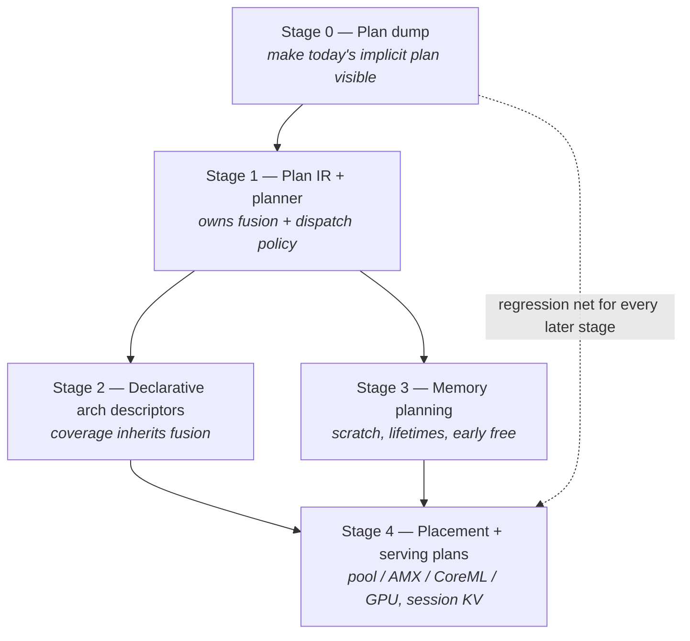

# nue Roadmap — NueGraph and Model Coverage

Companion to [ARCHITECTURE.md](ARCHITECTURE.md) (what exists) and
[PERFORMANCE.md](PERFORMANCE.md) (what is measured). This is what comes next
and why, in the order the evidence justifies.

---

## The problem these two threads share

Fusion is **hand-wired into two modules** — `GQAttention` picks the fused QKV
path, `SwiGLU` picks the fused gate/up path — behind three overlapping env
gates (`NUE_FUSED_MATMUL`, `NUE_FUSED_ROWWISE`, `NUE_FUSED_DISPATCH`) plus a
Haxe/Rust branch. Measured, those fusions are worth **+21–25%** (shared
activation quantise) and **+13.2%** (single dispatch over the joined row space).

So **a new architecture either re-wires fusion by hand or silently forfeits 30%+**.
Coverage and performance currently fight each other. Every family added the
current way makes the next optimisation harder to land everywhere.

`NueGraph` is the decoupling: arch builders declare *structure*, a planner
applies *policy* uniformly.

### Why "performance maintainer" is the load-bearing half

2026-07 supplied the evidence that this is not a tidiness exercise:

- `NUE_FUSED_MATMUL` sat **off by default for months** on a "regressed on macOS"
  verdict that re-measurement **refuted** (+3.1% Q6_K, +1.8% Q4_K_M).
- Three fusion gates with no single policy, and pool policy that wants
  *opposite* settings depending on whether the Haxe kernels are active.
- A **~1GB/request** allocation leak ran undetected because nothing asserted an
  invariant about the hot loop.
- Several confident performance conclusions were **wrong** until interleaved
  A/B caught them — including two of mine in the same session.

A plan that can be **dumped and asserted** turns this from folklore into
something CI can hold. That is the primary deliverable; throughput wins are the
secondary one.

**Correction to the older design note:** ARCHITECTURE.md used to say NueGraph
"is not expected to double throughput; the core decode limit remains Q4 matmul
bandwidth". Dispatch overhead alone was worth **+13.2%**, and the INT8 parity
gap is provably *not* in the dot product. The planner has more headroom than
that framing credited.

---

## Staging

### Stage 0 — Plan dump (observability first)

Make the plan that *already exists implicitly* explicit and printable, before
building any IR. Per layer: which kernel each projection takes, which fusions
fired, dispatch count, pool policy, and which platform path (Haxe / AMX / CoreML
/ VNNI) served each phase.

Built from what already exists (`NUE_DUMP_Q4_GATES` census, `NUE_PROFILE_POOL`
band/quant/dispatch counters). No refactor, low risk, and it is the observability
spine the later stages need anyway.

**Acceptance:** on a Q5_0 and a Q6_K run the dump names every projection's
kernel and fusion state, and the numbers reconcile with the pool profile. It
must make a stale gate obvious at a glance — i.e. it would have surfaced
`NUE_FUSED_MATMUL` immediately.

### Stage 1 — Plan IR + planner owning fusion/dispatch — SHIPPED

The planner, not the modules, now decides each layer's fusion route, and the
acceptance bar was met: arm A output is byte-identical from before Stage 1 to
after it — plan, census, cache, dispatch count and generated text — on both
Qwen2.5-0.5B-Q4_K_M and q5_0.

What landed is narrower than the original sketch, and the constraints are worth
keeping because each of them cost something to find.

**`NuePlan` is a build-time local.** Constructed in `LlamaArch.build()`, dumped,
dropped. Never a field, never a static. `LlamaModel` gained nothing: a `Null<>`
field holding a nue-defined class has an open corruption record, and there were
zero such fields in nue before this. The cost is that `prefillHandle` is attached
later by the loader, so the dump prints `graph_prefill=deferred`.

**It lives in `nue.arch`, beside `LlamaArch`.** No new package, no new directory.
`LlamaArch` does every field read and passes primitives in, so `NuePlan` reads no
foreign field. It is never read by `Q4Matmul`, `Linear`, `GQAttention` or
`SwiGLU`.

**Policy travels as an `Int` on the receiver the kernel already holds** —
`planHaxeMat`, `planFusedQkv`, `planFusedPair`, `planDbgShape`,
`planDecodeSplit`. Nothing new crosses a module boundary on the hot path; the
last step removed one cross-module static call per block per token.

**Zero means unplanned, and it is load-bearing.** A module built outside the
builder holds zero and decides its route at the call site exactly as before —
which is why the two standalone examples needed no edit, and why the states are
1 and 2 rather than a boolean.

**New instance fields are appended, never inserted.** Importers resolve fields by
declaration order.

**`Q4Matmul` was not edited.** `matmul` / `matmulFused` / `noteFusionSite` /
`dumpPlan` signatures are frozen, the seven private kernel gates stay
kernel-owned, and `dumpPlan()`'s gates line remains the sole authority for them.

**The route was proved, not assumed.** A verification mode compared the planned
route against the live expression on every forward, across all 64 combinations of
the six fusion gates on both models — 128 runs, zero mismatches — and was then
deleted, so the shipped gate surface is exactly the pre-existing set.

Cut from Stage 1 deliberately: the `forwardLayers` hot-loop rewrite, which buys
nothing while one layer kind exists and touches an aliased in-place residual; and
any node vocabulary that generation consumes. The plan observes and routes; it
does not execute.

The protocol that made this checkable is in PERFORMANCE.md under *Comparing two
trees for identical behaviour*, and the harness is `nue/bench/plan/`.

### Stage 2 — Coverage via declarative arch descriptors

With the planner owning kernels, an architecture becomes a **declaration**:
norm type (RMS/Layer), activation (SwiGLU/GeGLU/GELU), RoPE style (NORM/NEOX) and
scaling, QKV bias, tied embeddings, head_dim override, sliding window, MoE
routing. Today the entire llama/qwen2 difference is one line
(`rope.neox = arch == "qwen2"`), which shows how much of the surface is already
shared — and how little is currently expressible.

Current state: `ArchRegistry` registers **llama, qwen2 → `LlamaArch`** and
**bert → `BertArch`**. The `Architecture` enum *names* Mistral, Gemma, GPT2,
Falcon and Phi for chat-template selection, but **none are buildable**.

Order by cost: **Mistral** (llama-shaped, nearly free — good first proof that
the descriptor works), then **Gemma** (GeGLU, norm scaling, tied embeddings,
head_dim override), **Phi** (partial rotary, fused FFN), then LayerNorm families
(GPT2/Falcon) and MoE.

**Mistral was run through the current structure first (2026-07-27) to pressure-
test this design, and it moved the requirement.** The *structure* was indeed
free — a Mistral GGUF declares `general.architecture = "llama"`, so it already
routes to `LlamaArch` unchanged. What was broken was **identity**:
`Architecture.fromString` can never return `Mistral` for a real GGUF, and the
chat template mapped `Llama, Mistral → LLAMA3`, emitting Llama-3 header markup
into a model that never saw those tokens (the same bug silently mis-templated
**Llama-2**). Fixed with an `[INST]` template kind detected from tokenizer
specials, not the arch string.

So the descriptor requirement is sharper than "declare norm/activation/RoPE":

- **Architecture identity is not the GGUF arch string.** Mistral, Llama-2 and
  Llama-3 all report `llama` and need different prompt formats — and, for
  Mistral v0.1, different attention (sliding window, still unimplemented).
  Identity must be evidence-based (tokenizer specials), with the arch string as
  a weak hint.
- **Family ≠ builder.** Several families legitimately share one builder while
  differing in template, stop tokens and attention policy. The descriptor must
  separate *how to build the graph* from *how to talk to the model*.

Gemma remains the first real test of the structural half, since it is the first
that genuinely cannot reuse `LlamaArch`.

Each new family must inherit fusion **automatically** — that is the test of
whether Stage 1 succeeded.

### Stage 3 — Memory planning

Tensor lifetimes, view ownership, reusable scratch, KV layout, logits buffers,
early-free points computed before the run. Grounded: ~490 frees/token remain
after the GQA fixes (0.5–2.3% of wall), and the 2026-07 box-leak showed the cost
of having no invariant to assert.

### Stage 4 — Placement and serving plans

Choose CPU spin-pool / LLVM tier / platform API (AMX, CoreML PrefillGraph, BNNS
Graph, VNNI) / GPU per node from dtype, shape, context length and host
capability — a single place for the decisions currently spread across gates.
Then serving plans: session KV reuse, prefix-cache policy, speculative verifier
paths, warm plan caches for `.rzb` / AOT / server. (Prefix-cache sequencing and
the "do NOT build PagedAttention" analysis stay as recorded in ARCHITECTURE.md
§Open levers — build the multi-turn workload first, then the cache.)

---

## Rules for this work

- **Reproduce before you improve.** Every stage lands behaviour-identical first;
  policy changes are a separate, separately-measured commit.
- **Interleaved A/B or it did not happen.** This machine drifts up to 17%
  between batches; only alternating ON/OFF medians with non-overlapping ranges
  count. See PERFORMANCE.md §Benchmarking rules.
- **Bit-identical output** is the correctness bar for any fusion/planning change
  (diff the generated text, not just coherence).
- **No Rust fallbacks.** A Haxe-vs-Rust gap is a work item against the kernel,
  the pool or the compiler. Platform APIs (AMX/CoreML/BNNS/VNNI) remain the one
  sanctioned FFI.

## Carried-over performance work (independent of NueGraph)

Tracked in PERFORMANCE.md §Open; listed here so the roadmap is not read as the
whole picture:

1. **INT8 parity −18.9%** — deficit is outside the dot and outside dispatch
   count; unexamined: weight streaming / cache blocking, `fusedQkvIntoArr`'s
   single-pass traversal, per-row scale-load + f32 store tail.
2. **Haxe INT8 run-to-run variance** (84.4 / 94.5 / 96.4 vs Rust's σ≈0.3) —
   suspect pool scheduling; may be costing the INT8 median more than any kernel
   change would recover.
3. **Prefill 1.9× slower** than the Rust reference — dominates long prompts.
4. **Sampler 12–13% of wall**, model-independent.
